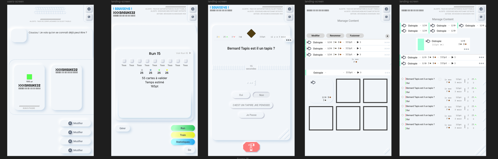

# MemoryApp

This project was generated using [Angular CLI](https://github.com/angular/angular-cli) version 19.1.5.

Disponible : https://nissme.fr/

## Pour tester

npm install -g @angular/cli 
npm install 

To start a local development server, run:

```bash
ng serve
```

Once the server is running, open your browser and navigate to `http://localhost:4200/`. The application will automatically reload whenever you modify any of the source files.


# Trigger Devmode

Click on the logo to make the dev bar appears, it's gonna be easier to test. Testing data do not integrate pictures or sound, even thought it works. 


## Used Libs
 - Luxon (moment est passé en maintenance legacy et je voulais voir ce que luxon avait dans le bide. Deplus je suis pas assez intelligent pour les date en js natif)
 - bootstrap 5.3 
 - Dixie (wrapper IDB) 
 - RX JS (pour des flux de donnée )


## Used Tool
- Figma => export d'icons et maquettage partiel. 
- Figjam => whiteboard pour visualiser et décharger mentalement sur les tache complexe
- RunJS => espace en isolation pour tester du javascript / Typescript 
- Perplexity => moteur de recherche IA. C'est vraiment top pour apprendre car il cite les sources


## Deployment 

Disponible : https://nissme.fr/

Le script pour le déploiement se trouve dans : github/workflow.

Il est encore en ftp car je suis vraiment mauvais en ssh je comprend pas un truc à un moment je pense. 

Je passe par O2switch car Français et c'est assez facile à prendre en main. Y'a un fichier htaccess à config dessus.


## Branch on repo

Je vais continuer ce projet donc sur le site web ce sera la cette version. Et je garderai cette branche "main" en l'état pour être évaluer au moment du rendu. 

Il y a une branche main-save sur le github. En fait y'a un moment ou j'ai push --force (oui je sais mais j'avais peur de rebase ou truc), donc j'ai quand même save au cas où cela aurait écrasé les historiques de commit existants.  

## Features

# Création de catégories, thèmes et cartes

Ajouter / Supprimer / Rename un profile
Ajouter / Supprimer un thème (rename pas implémenté à ce jour)
Ajouter / Supprimer un thème dans un thème (pas implémenté à ce jour)
Ajouter / Supprimer une carte (rename et modification pas implémenté à ce jour)

Video pas implémenté. Je me demande si c'est aussi chiant que les images ou c'est aussi facile que le son.  

Notifications : ne marche pas (Bon je pense que en fait je suis parti sur un truc trop compliqué alors que je pouvais faire plus simple)

Sachant que les medias sont 'Blobisé' j'sais pas si une video c'est vraiment viable avec ce système. Ou alors il faudrait les compressées. Ce que j'ai essayé de faire pour les images à un moment avec une lib webassembly. Alors je l'ai plus en tête (car oui ça a pas marché), mais je sais que c'est celle sur laquelle Sharp est build.

Bon c'est sur que en terme de perf ça va pas être top de stocker dans idb les blob, mais c'est la solution la plus simple que j'ai trouvé pour pouvoir récupérer les images depuis l'export des données en json.

#	Révision et répétition espacée

 L'espacement fonctionne cependant ont répète les espaces. Ainsi si l'espace est de 4 on le fait le 5eme jours. 

 Deplus pour garantir une pertinence dans l'apprentissage, une carte créée ne se fait pas le jour même. Cela ne sert en effet à rien (à mon sens et avec l'avis de ma soeur en psychologie cognitive). Le processus d'apprentissage espacé fonctionne le mieux quand il faut aller chercher dans sa mémoire "à long terme". Or quand on vient de rentrer la carte dans l'application celle ci se trouve toujours dans la mémoire de travail / instantanée. cf courbe de l'oublie. 

Les cartes à partir d'un certain niveau ne sont pas encore enlevées de la base de données.

Au début je voulais faire un algo pour l'espacement mais bon au final j'ai fait une table de nombre et l'index est le niveau de validation comme ça basta. (Bon j'ai surtout galéré du coup j'ai fait ça).

 # Structure et organisation du code

Au début je suis parti sur une archi et arborescence bien pour un petit projet, mais je me suis vite senti à l'étroit. De plus j'ai pu me rendre compte que certain de mes choix étaient mauvais. Cependant j'ai préféré continuer à maintenir comme cela jusqu'au rendu pour être sur de livrer quelque chose. On parle de tout passer en Features / User Flow. Y'a qu'à voir le dossier service pour comprendre. Je pense que ce dossier peut être considéré comme un crime de guerre auprès de Robert C Martin. nb: Je viens de regarder le dossier views et c'est aussi un crime de guerre l'orga.

# Utilisation de Angular, store et Angular**router**

En Angular il me semble qu'il y a des stores de lib tierces, mais les services sont amplement suffisants. Cela demande une organisation (dont j'ai manqué) pour éviter les références circulaires. 

Pour le router mes routes sont dans src/app/app.routes.ts et le router dans le src/app/app.component.html. Puis j'appel le service Router pour effectuer des actions. C'est assez simple comparé à un React Router Dom.


# Qualité du code HTML et validité

Pour cela et l'accessibilité bootstrap 5.3 aide pas mal. Il manquerait des titre aux pages et des alt sur les media et images (réactif ?). Je pense que certain bouton ne sont pas très accessibles. 

J'aime bien les data-XXX, mais c'est vrai que à débugger c'est bcp plus chiant car les  bug sont "bizarre". Après c'est quand même super pratique car on peut dégager plein de code des composants donc je pense que c'est un problème de skill de ma part.  


# Responsiveness de l’application

J'ai designer mobile first comme ça on se fait pas chier. Même si l'optique d'une ui plus adapté au format bureau est envisagée.

Pour être honnête, j'ai un problème sur mobile avec la fonction qui dans la base de donnée enregistre un thème. Il faut que j'investigue mais j'pense que je gère mal un appel dans mon service database, mais c'est marrant (non j'ai pleuré 2 fois) que ce soit que pour les thèmes et que sur mobile. Au moins le problème est cerné.


#	Interface utilisateur et design

Bon de base j'avais fait une tite maquette mais en fait j'ai vite arrêté car le nerf de la guerre et la vraie difficulté c'était le dev. Donc j'ai tout envoyé à la volée au fur et à mesure. Ca pourrait être bcp mieux et mais ça passe.




#	Données de test

Cliquer sur la barre du logo trigger le devmode pour skipper facilement les jours et utiliser les données de test. 


# Atomique design

Vraiment le seul truc que je veux atomiser c'est mon crâne right now. Y'a plein de composant qui devrait purgé dans un avenir proche. Exemple : Au lieu d'avoir un composant pour rename et un pour display. Bah je prend le même et je remplace le "hX" ou "p" par un input. 

Je reprend l'archi du design system de bootstrap en modifiant les tokens de couleur ou les fonts.

# Gestion multimédia 

Image et son : Oui
Video : non

# Gestion des tests 

 Bah j'ai essayé avec le framework intégré à angular pour les test mais bon faudrait que je bench dessus encore car c'est un peu compliqué. (En même temps angular si c'est simple c'est que c'est un rêve ou qu'on a pas compris un truc). Puis il y a un peu un biais de coût irrécupérables, car si on commence pas dès le début bah ça fait qu'on a une quantité énorme à faire ensuite. 

 J'ai quand même envoyé un test lighthouse, et même si y'a une marge de progression c'est moins pire que ce que j'imaginais.


## Phase de développement 

Au début je codais tout propre et pourtant j'allais vraiment trop lentement. Ensuite quand j'ai du accélérer bah ouai j'ai écris des composant c'est vraiment dramatique. Mais bon vitesse et bon code c'est compliqué en tant que junior. Donc j'ai vraiment vu la qualité de mon code drop, cependant j'écrivais plus rapidement du code qui fonctionnais. "Rapidement" c'est sans compter l'entretient et l'absorbtion de la dette technique. Donc plus rapidement c'est très vite dit.


## De génie à idiot
J'ai aussi passé mon temps à me dire "je suis un génie" ou "je suis tarpin con". C'est bien je pense car au moins ça veut dire que j'ai progressé. Le meilleur exemple (là tu vas rire), c'est que je me suis fait chier pour faire des types qui s'infèrent depuis une classe. Voila j'ai du passé une semaine sur ce truc pour que au final je me rende compte que on peut utiliser les classes comme des types (vraiment j'avais envie de me flinguer). Alors peut être que c'est utile pour des type reactif et modulable en plein runtime, mais pas là en tout cas. 

```
export class MemcardObj {
  constructor(
    public id: string,
    public title: string = '',
    public cardType: eMemcardType,
    public recto: tMemcardContent[],
    public verso: tMemcardContent[],
    public validationLevel: number = 0,
    public Historic: tHistoricEntry[],
    public Statistics: tMemCardStatistics,
  ) {}
}

export type tMemcard = InstanceType<typeof MemcardObj>;
```

Au début j'ai aussi utilisé des interface au début mais j'ai vite switché sur des type/classe. Car bah c'est des types extensibles (ce qui peut amener des effets de bord). Il faut savoir que pour imbriquer des themes dans des themes on ne peut pas avec des Classes seulement des Type / Interface.


Un bug qui m'a aussi embêté longtemps et c'était un peu chiant à débogguer c'est que je manipulais des données d'une autre variable, dans une variable fonctionnelle. Et ainsi les données ne se modifiait que à l'appel de cette fonction, or il me les fallait avant. Bon à régler c'est vraiment pas compliqué mais à trouver et localiser j'y ai passé un ptit moment.  

# Truc bien

J'ai eu la présence d'esprit d'unshift mes historic dans les cartes. Comme ça l'entrée la plus récente est l'index 0.


# Dossier CPI

Bon je suis pas intimement convaincu que la violence soit une solution mais franchement je mérite une droite sur certains composants. Genre eux : 

- memory-app\src\views\sections\create-memorycard\create-memorycard.component.ts
- memory-app\src\views\sections\card-displayer\card-displayer.component.ts

Bon c'est quand je me suis focus sur la quantité de code plus que la qualité. Y'a une dette technique incroyable sur le projet qui devra être réglée. 


## Conclusion 

J'ai vraiment appris plein de notions sur ce projet. Mais à un moment on peut pas passer son temps à review le même code en boucle à chaque fois qu'on progresse. Oui la qualité du code est mauvaise à certains (certains ?) endroits (et dsl pour la charge mentale qu'implique la correction). Mais tout le monde parle de bon principe de code, mais celui que je vise c'est faire du code qui marche, et j'avoue à certains moments c'était pas gagné. Et je voulais vraiment rendre un truc avant de devoir clean et tout casser. Mais je sais que ça me permettra d'aborder ce genre de projet avec une meilleure perspective. 

J'ai pu mettre en place des flux de données avec des observable pour une réactivité "native". C'était vraiment la galère mais après quand tout ce met à jour à la volé c'est vraiment magnifique. 

J'ai aussi pu mettre en place de l'immutabilité (même si j'pense pas que c'était nécessaire), donc modifier une nouvelle entrée en mémoire et remplacer l'ancienne au lieu de la modifier directement. Bon j'en ai pas mis en place partout par contre. 

Mentions spéciales : Les promesses, try => catch, fonction anonyme, l'opérateur '??' (alors lui c'est vraiment le goat)

Par contre j'ai pris vraiment un grand plaisir à réaliser ce projet (on peu parler d'hyperfixation).

Les PWA c'est vraiment incroyable. La seule limite d'un point de vue utilisateur c'est que le process est attaché à chrome/mozilla. Et donc, par exemple le mélangeur audio windows ne detecte que chrome (ce qui fait sens). 


# Javascript jpp 

Genre la je veux juste faire du dev soft. Un truc bien, pas compliqué pour rien et pas implémenté en 10 jours et jamais fixé. Quand je vois C# je me dit mais pourquoi Javascript en fait (bon y'a plein de raisons mais c'est pas un TEDX). Alors c'est pas de moi, mais ça fessait sens quand je l'ai entendu (je crois c'était sur "front end masters") c'est que javascript c'est de la "Configuration" plus que de la "Convention". Et en vrai j'pense que en entendant ça, j'ai pu comprendre pas mal de trucs et mettre un mot sur ce qui me dérangeait. 

Puis prettier ou autre qui rende juste le code plus moche aussi jpp. "Oui mais il faut le configurer" ouai mais on passe notre temps à configurer les espaces de travail et bon c'est chiant.

Mais même en terme de convention de nommage mais c'est mauvais. J'vais vraiment utiliser les conventions de nommage de C# ou autre sur les projet persos. Alors oui surement que des gens vont hurler quand ils vont voir mon code, mais qu'est ce qu'ils vont faire ? Me hack ? Voler mes clés SSH ? En vrai ce serait top car j'arrive pas à les retrouver.  

Heureusement il y a typescript.

# Angular 

Bah c'est bien. C'est compliqué pour rien et c'est vraiment overkill même pour une mini-app-web. Après ça permet bcp de chose et l'expérience de développement est assez cool (avis perso : comparé à React). Je regrette pas forcément d'être parti dessus, car je veux vraiment approfondir une techno pour pouvoir mettre en place des comportements / pattern avancé. Mais la courbe d'apprentissage c'est un mur hein. Quand en plus on veut apprendre RxJS en même temps bon bah c'est pas du plaisir. Je pense que un truc comme vue ou svelte après c'est de la flotte et ils auraient étés plus adaptés à ce cas, aurait beaucoup moins ralenti le temps de dev et j'ai bien envie de truc simple mtn là aha. 


# Difficultés

Tout, javascript, "TS ERROR gnagna could be undefined", les notifications, RxJS, immutabilité, Dixie 

Bon après y'a du classique avec le lifecycle d'un component. J'appel des choses qui n'existe pas encore à un endroit toussa toussa.

Estimation du temps et organisation : peut être que proposer quelque chose de plus simple aurait été mieux et plus rapide. J'ai tendance à over-scope (sky || burnout is the limit).


# Suite du projet

C'est toujours cool d'avoir un projet complet et qui est pas une TODOLIST. Donc je vais continuer à bosser dessus, dans l'ordre : 

- Je vais clean tout le code et restructurer le projet car là c'est plus possible le projet il a 3-4 mois et j'ai du code "legacy" (genre je touche pas car on sait jamais si ça casse cf : le databaseService). Donc j'ai une grosse dette technique à régler. Tout le long j'ai eu le culs entre deux (16*) chaises entre "des méthodes dans des classes ou des service pour manipuler les données",  "orienter l'arbo en features/userflow ou par écrans". Bref j'ai accumulé un petit bordel, et maintenant que le projet est rendu je vais pouvoir clean tout ça. 
  
- Review le code pour une meilleure convention de nommage 
  
- Implémenter du Testing et orienter vers du test Driven
  
- Régler le problème de la fonction pour register des thèmes sur mobile, implémenter du swipe
  
- Retravailler la re-usabilité de certains components 
  
- Finir d'implémenter le reste des features demandées, et de celle que je voulais ajouter (récurcivité/imbrication des themes, système de points) 
  
- Itération pour les Animations et du design 
  
- Tester de shipper avec electron et Ionic
  
- Intégrer un service de synchronisation cloud (firebase surement ou un equivalent auto hébergé)


# Suite de l'apprentissage 

- TDD
- Setup le ci cd en ssh
- RxJS
- Web assembly
- essayer de faire des commit potables
- Approfondir le hors zonne de angular (faire tourner du code js en dehors de angular ce qui permet de lancer des truc dans un autre thread (je crois))
